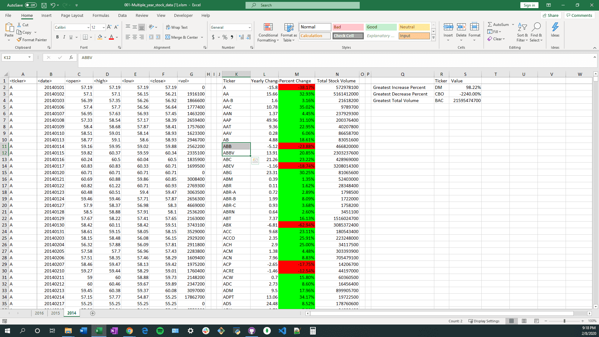

# 02_Stock_Data_VBA 

  

In this assignment, the objective is to build ....

## Data Source(s)
* Excel File

## Pre-requisite(s)
* Enable the 'Developer' tab in Excel to see VBA Code
* Because the data files are too big to be stored on GitHub, they will be stored on Google Drive, please see the link below to this folder: 001-VBA Code & Data.

## Methods
* VBA programming

## Website or Links
![001-VBA Code & Data] (https://drive.google.com/drive/folders/1Vdj54pimvuc1DcbjQ4wQf3vtC0vrcIjm?usp=sharing)

## Results

